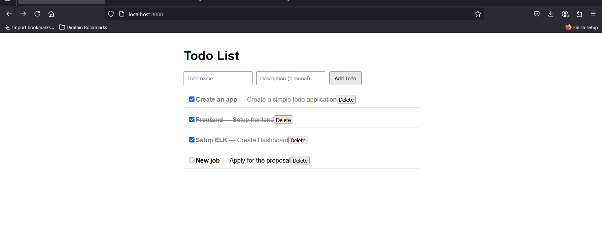
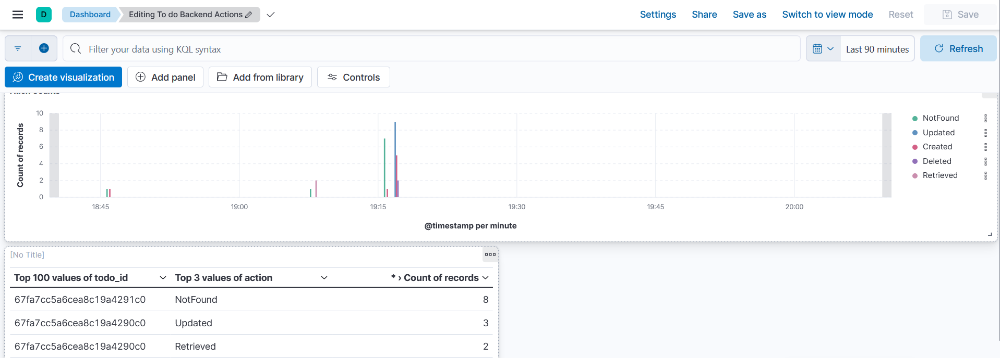

# 📝 Todo App

A full-stack Todo application built with **ReactJS** for frontend **NestJS** for the backend, **MongoDB** for data storage, and **Docker Compose** for deployment. The app allows users to:

- ✅ Create todos
- ❌ Delete todos
- ✔️ Mark todos as done


## 🚀 Getting Started

### 🧰 Requirements

- [Docker](https://www.docker.com/)
- [Docker Compose](https://docs.docker.com/compose/)


---

## 🐳 Docker Deployment

### 🔧 Step 1: Build and Run

```bash
docker-compose up --build
```

This will:
- Build the backend and frontend images 
- Start backend and MongoDB containers
- Start NGINX container and serve the frontend on port `8080` 
  http://localhost:8080
- Serve the backend on port `3000` 
  http://localhost:3000

- Start containers for ELK, Filebeat and a container to automatically setup dashboards for backend. Kibana URL: http://localhost:5601


## 📸 Screenshots





## Consistency

There is 2 volumes created.
 - Elastic data
 - MongoDB data


## 🧹 Cleanup

```bash
docker-compose down -v
```

This will stop containers and remove volumes (MongoDB data).
